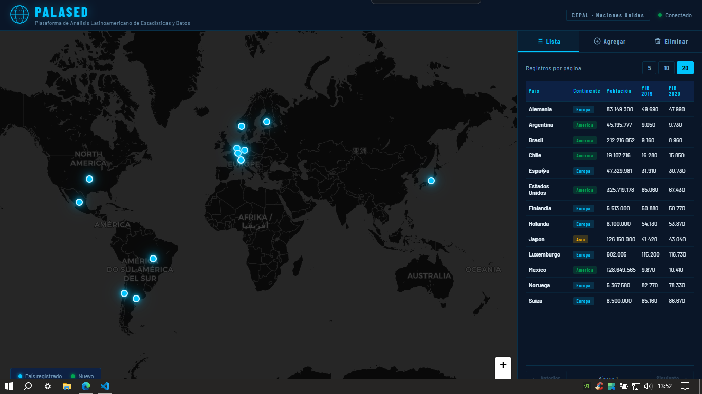
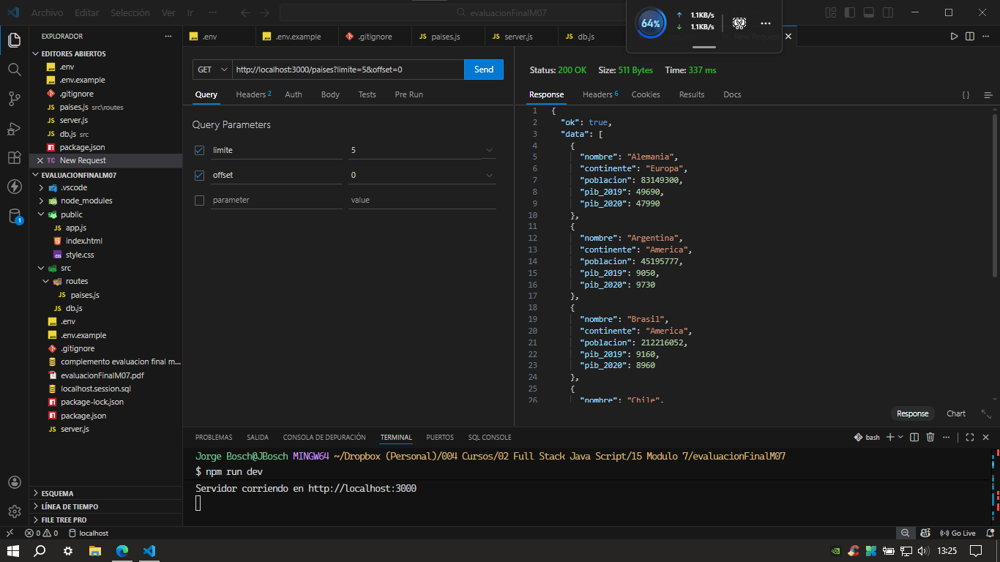
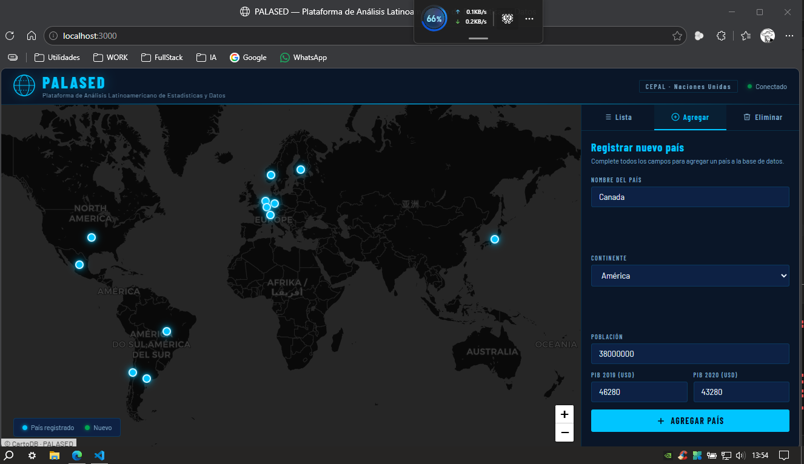
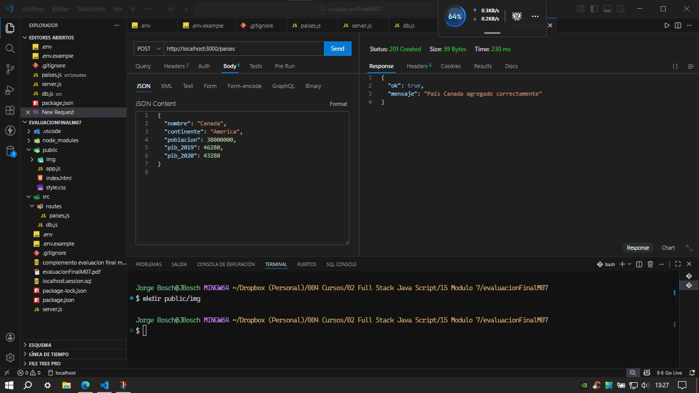
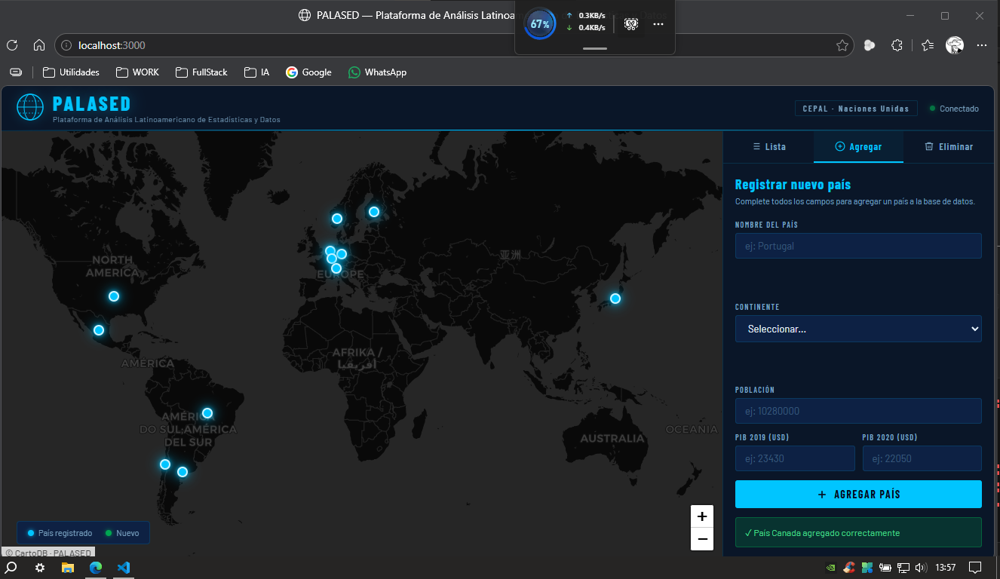
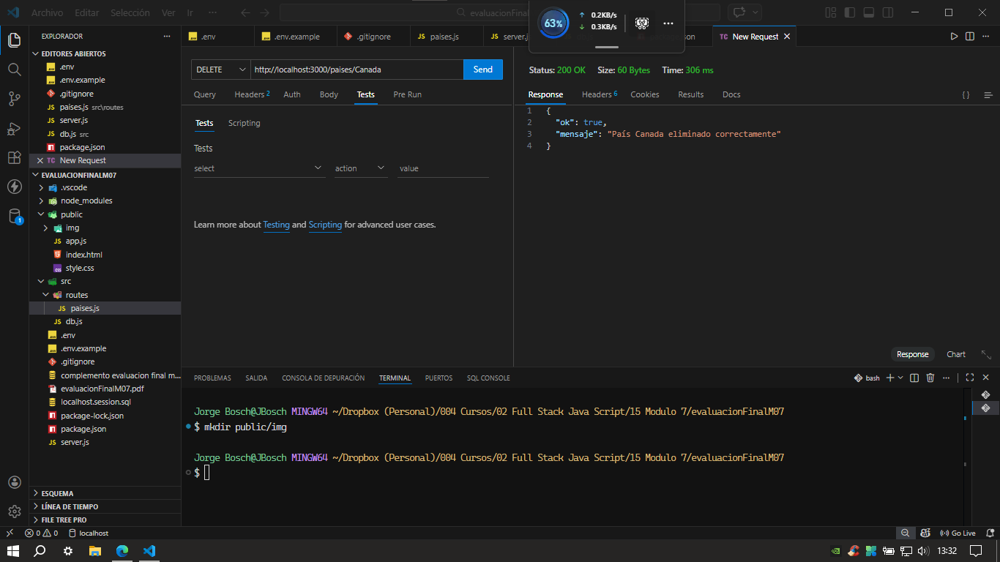
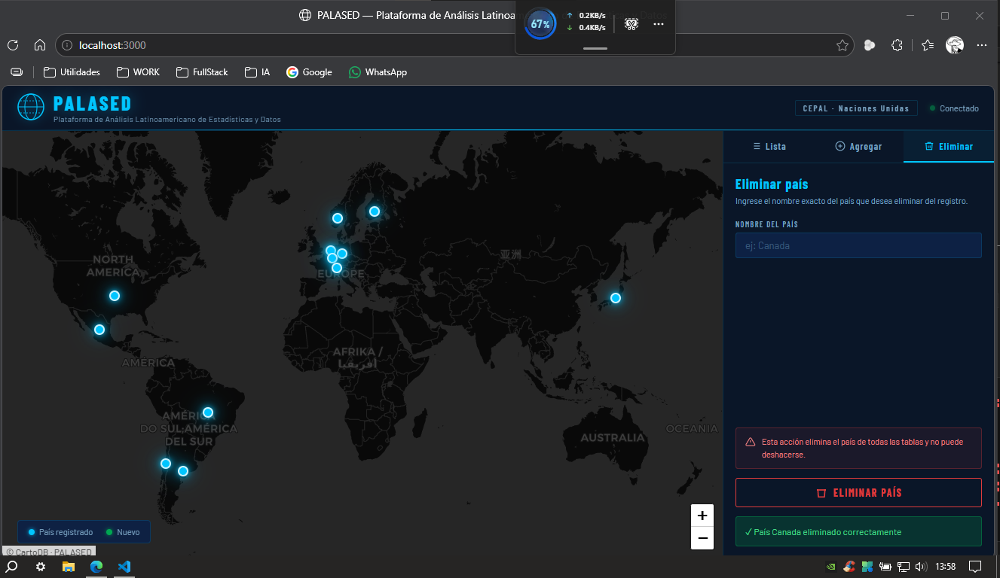

# 🌍 PALASED — Plataforma de Análisis Latinoamericano de Estadísticas y Datos

> Evaluación Final Módulo 7 — Fullstack JavaScript  
> Stack: **Node.js · Express · PostgreSQL · pg · pg-cursor · HTML · CSS · JavaScript · Leaflet-map**

---

## 📋 Descripción

Servicio REST que administra una base de datos de países con información demográfica y económica (PIB 2019 y 2020). Implementado con **transacciones**, **manejo de errores** y **cursor paginado** mediante `pg-cursor`.

El frontend **PALASED** presenta un mapa mundial interactivo con paleta de colores inspirada en la CEPAL / Naciones Unidas, permitiendo visualizar, agregar y eliminar países directamente desde la interfaz.

---

## 🗂️ Estructura del proyecto

```
evaluacion-m07/
├── src/
│   ├── db.js                  → Pool de conexión con pg
│   └── routes/
│       └── paises.js          → Endpoints GET, POST, DELETE
├── public/
│   ├── index.html             → Frontend principal (mapa + panel)
│   ├── style.css              → Estilos paleta CEPAL
│   ├── app.js                 → Lógica fetch y mapa Leaflet
│   └── img/                   → Evidencias y pantallazos
│       ├── frontendCompleto.png
│       ├── getListaPaises.png
│       ├── rellenoAgregarPais.png
│       ├── posAgregarPaisOK.png
│       ├── postNuevoPais.png
│       ├── deletePais.png
│       └── deletePaisFronend.png
├── server.js                  → Punto de entrada del servidor
├── .env                       → Variables de entorno (no incluido en Git)
├── .env.example               → Plantilla de variables de entorno
├── .gitignore
└── package.json
```

---

## ⚙️ Instalación y configuración

### 1. Clonar e instalar dependencias

```bash
git clone <url-del-repo>
cd evaluacion-m07
npm install
```

### 2. Crear la base de datos en PostgreSQL

```sql
CREATE DATABASE evaluacion_m07;
```

### 3. Ejecutar el archivo SQL para crear las tablas

```bash
\c evaluacion_m07
\i 'ruta/al/archivo/complemento_evaluacion_final_módulo_7_JS.sql'
```

### 4. Configurar variables de entorno

Copia el archivo de ejemplo y completa tus datos:

```bash
cp .env.example .env
```

```env
DB_HOST=localhost
DB_PORT=5432
DB_NAME=evaluacion_m07
DB_USER=postgres
DB_PASSWORD=tu_contraseña
PORT=3000
```

### 5. Iniciar el servidor

```bash
npm run dev
```

Abrir en el navegador: `http://localhost:3000`

---

## 🗄️ Diagrama de tablas

```
paises                    paises_pib
──────────────────        ──────────────────
nombre  (PK)  ──────────► nombre  (PK, FK)
continente                pib_2019
poblacion                 pib_2020

paises_data_web
──────────────────
nombre_pais  (PK)
accion  (0=eliminado · 1=insertado)
```

---

## 🔌 Endpoints del API

### GET /paises

Entrega la lista de países en bloques usando **pg-cursor**.

```
GET http://localhost:3000/paises?limite=5&offset=0
```

| Parámetro | Tipo    | Descripción                       |
| --------- | ------- | --------------------------------- |
| `limite`  | integer | Registros por bloque (5, 10 o 20) |
| `offset`  | integer | Desde qué registro comenzar       |

**Respuesta exitosa:**

```json
{
  "ok": true,
  "data": [
    {
      "nombre": "Alemania",
      "continente": "Europa",
      "poblacion": 83149300,
      "pib_2019": 49690,
      "pib_2020": 47990
    }
  ]
}
```

---

### POST /paises

Agrega un nuevo país a `paises` y `paises_pib`. Registra acción=1 en `paises_data_web`.

```
POST http://localhost:3000/paises
```

**Body JSON:**

```json
{
  "nombre": "Canada",
  "continente": "America",
  "poblacion": 38000000,
  "pib_2019": 46280,
  "pib_2020": 43280
}
```

**Respuesta exitosa:**

```json
{
  "ok": true,
  "mensaje": "País Canada agregado correctamente"
}
```

---

### DELETE /paises/:nombre

Elimina un país de `paises` y `paises_pib`. Registra acción=0 en `paises_data_web`.

```
DELETE http://localhost:3000/paises/Canada
```

**Respuesta exitosa:**

```json
{
  "ok": true,
  "mensaje": "País Canada eliminado correctamente"
}
```

---

## 📦 Códigos HTTP utilizados

| Código | Significado                    |
| ------ | ------------------------------ |
| `200`  | OK                             |
| `201`  | Created (POST exitoso)         |
| `400`  | Bad Request (campos faltantes) |
| `404`  | Not Found (país no existe)     |
| `409`  | Conflict (país duplicado)      |
| `500`  | Internal Server Error          |

---

## 🔄 Transacciones

El POST y DELETE usan transacciones explícitas:

```
BEGIN
  → operaciones en paises y paises_pib
COMMIT  (si todo ok)
ROLLBACK (si algo falla)

→ registro en paises_data_web (independiente, no afecta la transacción)
```

---

## 🖥️ Frontend — PALASED

### Vista principal con mapa



### GET — Lista de países



### POST — Formulario de agregar



### POST — Confirmación exitosa



### POST — Respuesta OK



### DELETE — Eliminar desde Thunder Client



### DELETE — Eliminar desde el frontend



---

## 🧰 Tecnologías

| Tecnología      | Uso                               |
| --------------- | --------------------------------- |
| Node.js         | Entorno de ejecución del servidor |
| Express         | Framework web y rutas REST        |
| PostgreSQL      | Base de datos relacional          |
| pg              | Cliente PostgreSQL para Node.js   |
| pg-cursor       | Lectura paginada de resultados    |
| dotenv          | Variables de entorno              |
| nodemon         | Reinicio automático en desarrollo |
| Leaflet.js      | Mapa mundial interactivo          |
| HTML / CSS / JS | Interfaz de usuario               |

---

## 👤 Autor

**Jorge Bosch** — Aprendiz Fullstack JavaScript  
Módulo 7 — Evaluación Final
